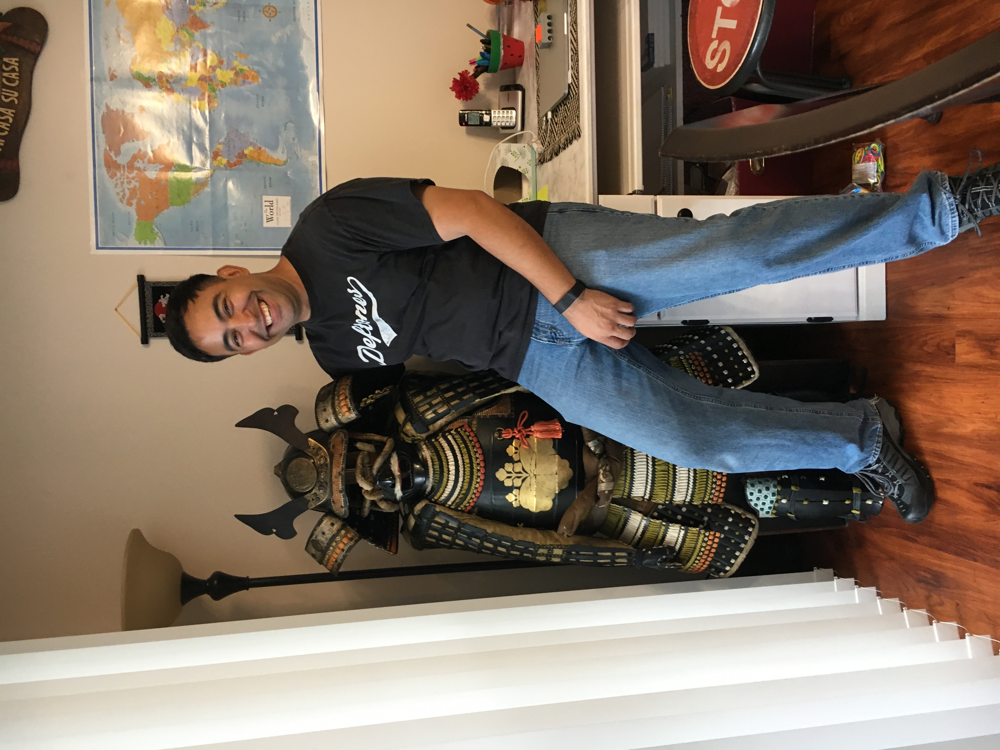

# All about me!
### Family
  How big is your family? **Mine, is huge!** I'm the baby of 7 kids, plus now I also have 2 kids of my own and am married. I have been married for over 10 years now and I have to say my husband is ***pretty awesome!*** *Below is a picture of him with his new love of his life.* I have been lucky enough to be able to stay home with my children for most of their lives aside from attending school. I'm greatful to be able to have had this time with my children as I know I will never get these years back. On that note I will be the mom that still tucks my children in a night even when they are teenagers!
  

### Education
I'm working on finishing my bacholors at University of [Maryland University College](http://umuc.edu). My goal is to get my degree in psychology. I have also attending the following schools.
+ [Mt. San Jacinto College](https://www.msjc.edu/Pages/default.aspx)
+ Kaplan College now known as [Brightwood College](https://www.brightwood.edu/locations/vista-ca/)
+ [Salt Lake City Community College](https://www.slcc.edu)

[Home](Suzy9586.github.io/index.md)
[Home](suzy9586.github.io)
[Home](suzy9586.github.io/index.html)

