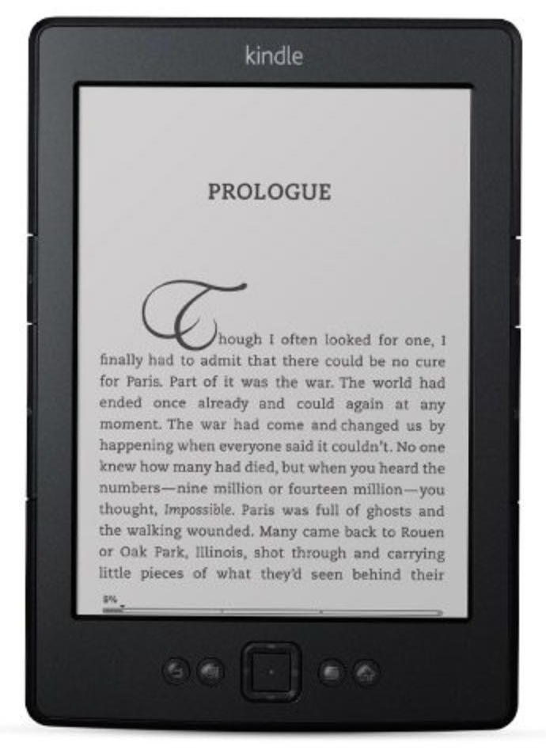

# The benefits of reading on an electronic device

## Perosnal choice
  First lets get one thing straight, it is a personal chioce for what you prefer to use as a reading device. I really like reading off of a tablet for the following reasons.
  1. I don't have to go to the store to find a book
  2. e-books are cheaper than hard copy books
  3. You get recommendations as soon as you load the book store of your chioce
  4. You can sign up for monthly memberships to have books at even a lower cost such as [Amazon](https://www.amazon.com)
  5. You don't have to store the hard copy books, they can take up a lot of room!
  ## However you perfer to read your books just make sure you read them!
  
  
  
  
  
  
  
  
  
  

[Home](https://suzy9586.github.io)
